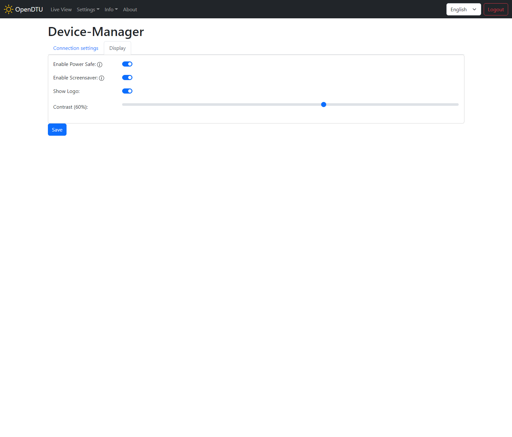

# Display integration

OpenDTU currently supports 3 types of displays (SSD1306, SH1106 and PCD8544). Currently only displays with a resolution of 128x64 pixel are supported. To activate a display you have to specify it's type and pin assignment either in the `platformio_override.ini` or in a device profile. Due to the fact that device profiles work with the pre-compiled binary the following documentation will only cover the device profile method.

You can either create your own device profile as described [here](DeviceProfiles.md) or use some pre-defined. The pre-defined profiles can be found [here](DeviceProfiles/). You can simply open the json file with a text editor of your choice to view/edit the pin assignment.

## Uploading Device Profiles

Use the "Config Management" site to upload (Restore) the json file. Make sure to choose "Pin Mapping (pin_mapping.json)" in the combo box. After you click on restore the ESP will restart. At this point, the profile is not yet active. Please read the next chapter.

## Selecting a Device Profile

After you uploaded the device profile you can select the profile in the "Device Manager" view. After a click on "Save" the ESP will be restarted and the pin assignment is active. At this point the display should already show something. Please see the next chapter for display settings.

## Display Settings

Display settings can also be found in the "Device Manager".
